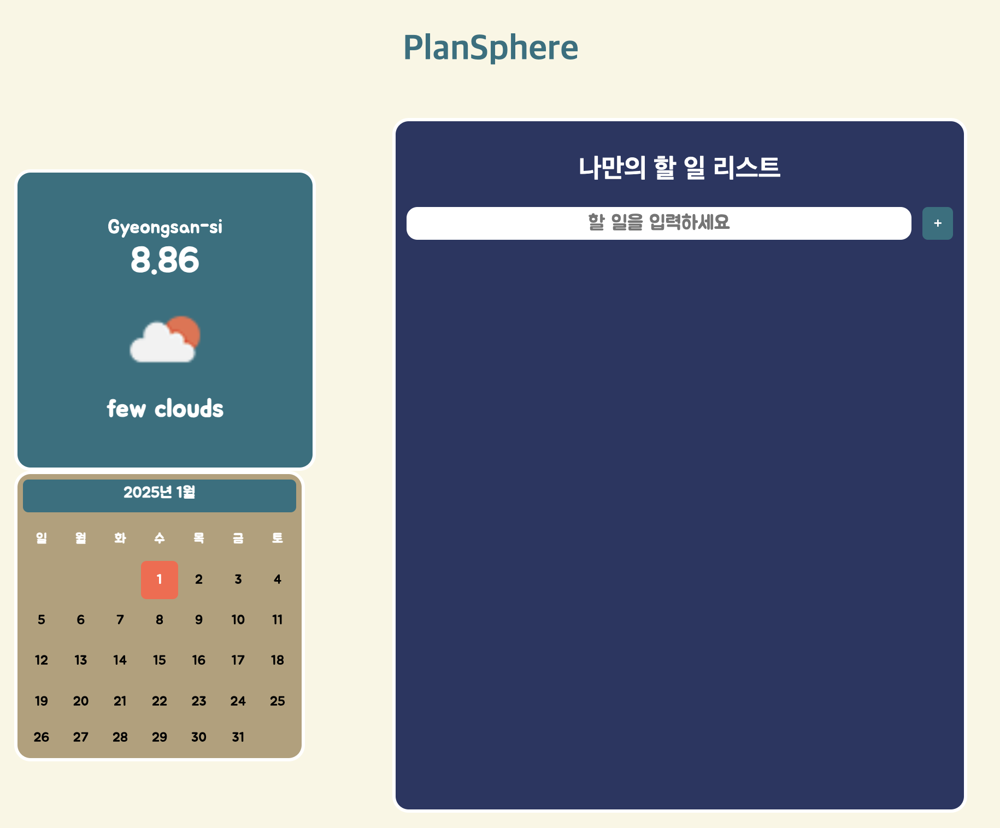
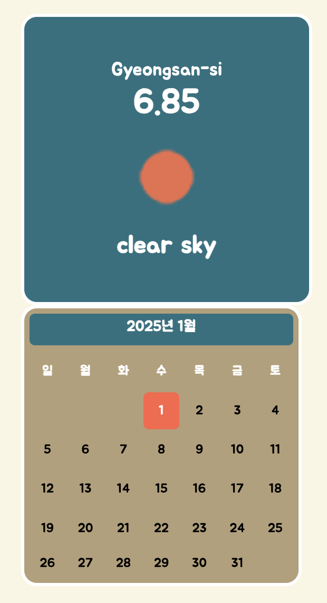
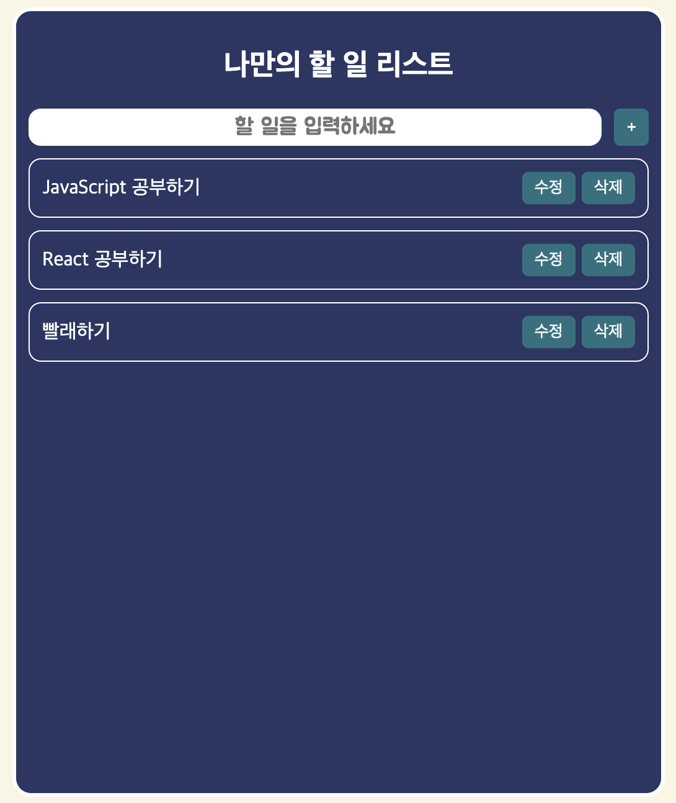

# 영화 관리 시스템

## 📜 서비스 내용

**PlanSphere**은 일정을 관리하고, 개인 할 일 리스트를 작성하며, 현재 날씨 정보를 실시간으로 확인할 수 있는 웹 애플리케이션입니다. 본 서비스는 날씨 API를 활용하여 사용자의 위치에 맞는 실시간 날씨를 제공하며, 사용자가 계획을 세울 수 있도록 도와줍니다. 또한, 개인 일정 관리 및 할 일 목록을 작성하고, 수정, 삭제, 완료 처리가 가능합니다.

### 주요 기능

1. **날씨 정보 제공**: 사용자의 위치를 기반으로 날씨 API를 사용하여 실시간 날씨 정보를 제공하고, 기온 및 날씨 상태를 이미지와 함께 보여줍니다.
2. **할 일 리스트 관리**: 할 일 목록을 추가하고, 수정, 삭제, 완료 처리가 가능하며, 로컬스토리지를 사용하여 데이터를 저장하고 불러옵니다.
3. **달력 기능**: 사용자가 월별 일정을 확인할 수 있는 달력 기능을 제공하여 일정을 계획하고 관리할 수 있습니다.

## 🛠 기술 스택

- **HTML**
- **CSS**
- **JavaScript**
- **OpenWeatherMap API**

## 🖥 개발 내용

### 1. 날씨 정보 제공

사용자가 현재 위치를 기반으로 실시간 날씨 정보를 확인할 수 있는 기능을 구현했습니다.

- **위치 기반 날씨 데이터**: `navigator.geolocation.getCurrentPosition` API를 사용하여 사용자의 위치를 가져오고, OpenWeatherMap API를 통해 해당 위치의 날씨 데이터를 가져옵니다.
- **날씨 렌더링**: 날씨 정보는 온도, 날씨 상태, 날씨 아이콘 등을 포함하여 사용자에게 보기 쉽게 제공하였습니다.

#### **문제 해결**

- **위치 정보 수집**: 사용자가 위치 정보를 허용하지 않는 경우를 대비하여, 위치를 찾을 수 없을 때 대체 기능을 추가하였습니다. (navigator.geolocation.getCurrentPosition())

### 2. 할 일 리스트 관리

사용자가 할 일을 추가하고, 수정, 삭제, 완료 처리를 할 수 있는 기능을 구현했습니다.

- **할 일 추가**: 사용자가 입력한 할 일을 목록에 추가할 수 있으며, 각 할 일은 고유 ID로 구분됩니다.
- **할 일 수정**: 할 일 내용을 수정할 수 있으며, 수정된 내용은 바로 업데이트됩니다.
- **할 일 삭제**: 완료된 할 일은 삭제할 수 있으며, 리스트에서 바로 제거됩니다.
- **할 일 완료 처리**: 할 일을 완료하면 상태를 "완료"로 변경하여 UI에 반영합니다.
- **로컬스토리지 사용**: 할 일 목록은 로컬스토리지에 저장되어 새로고침 후에도 데이터를 유지할 수 있습니다. 할 일 목록을 배열로 관리하며, 추가, 수정, 삭제 시 로컬스토리지에 실시간으로 반영됩니다.

### **문제 해결**

- **상태 관리**: 할 일 목록을 배열로 관리하여 데이터를 동적으로 처리하였고, 새로고침 해도 상태가 유지 되도록 로컬스토리지에 저장할 수 있게 하였습니다.

### 3. 달력 기능

사용자가 날짜를 선택하여 일정을 관리할 수 있는 달력 기능을 구현했습니다.

- **달력 표시**: JavaScript의 `Date` 객체를 활용하여 월별 달력을 동적으로 렌더링합니다. 현재 날짜는 강조 표시됩니다.
- **날짜 클릭**: 사용자가 날짜를 클릭하면 해당 날짜에 대한 일정을 추가하거나 수정할 수 있도록 할 수 있는 UI를 제공합니다.

## 💡 성장 경험

### **기술적 문제 해결**

TodoList는 JavaScript와 CRUD 기능을 사용해 혼자서 개발한 일정 관리 및 날씨 정보 제공 웹 애플리케이션입니다. 위치 기반 날씨 API와 할 일 목록 CRUD 기능을 구현하며 실시간 데이터 처리와 UI 업데이트 경험을 쌓았습니다. 또한, JavaScript의 Date 객체를 활용해 동적인 달력을 구현하면서 날짜 계산에 대한 이해를 깊게 할 수 있었습니다. 특히, 로컬스토리지를 활용하여 데이터를 저장하고 불러오는 기능을 추가하면서, 상태 관리와 사용자 경험 향상을 위한 중요한 기술을 익힐 수 있었습니다.

## 👀 서비스 화면

  
  

